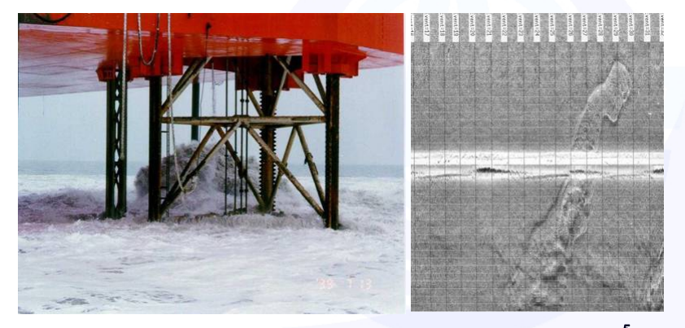
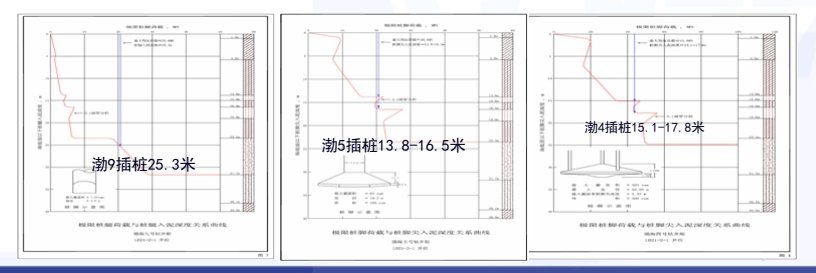
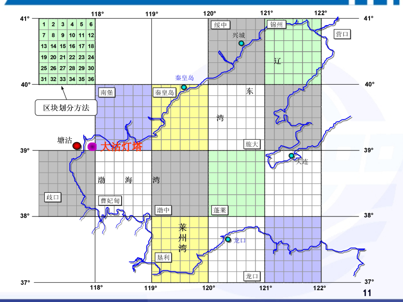
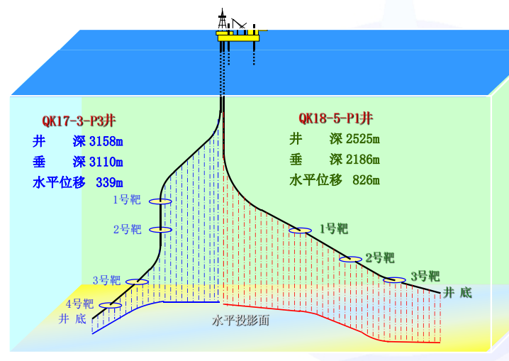
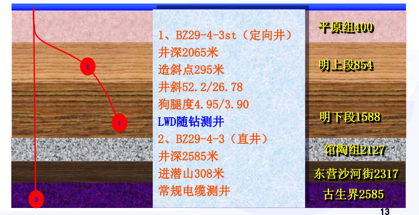

1
中海石油(中国)有限公司天津分公司勘探部 

1

提 要

一、地质设计分类

 二、做地质设计前的工作 三、地质设计的原则 四、地质设计编写准备 五、地质设计编写过程 六、主要问题讨论(编写过程中) 七、地质设计的内容 2

# 地地

口 探井(() 

口 开发开(平台)
口 内 装装 渤海 KK
海中 25-1/海中 25-1 周边田 B 平台开发 线 调整

中海石港(中国)有限公司天津分公司

划划 编 审人 复审人

批 网 11

重重 中海石油 《中国》有限公司天津分公司勘探部 2000 年 7月 25 日 图

3

# 二、做地质设计前的工作

p 井场调查 p 钻井船的工作能力 p 气象、海况和特殊作业要求

4

# 二、做地质设计前的工作

p 井场调查 水深测量图、海底地貌图、土壤物理及力学性质、浅层 气深度及厚度、水文和气象、海底建筑及障碍物。

5
# 二、做地质设计前的工作 P 井场调查 Bz29-4-3井由于浅层气原因,做

了井位调整。井位调整后,不能

# 兼顾浅层(明下段)勘探,最后 打侧钻Bz29-4-3St井。

6 6

# 二、做地质设计前的工作

布调查区大部。

p 井场调查 BZ25-1-C井场发现大范围的 反射异常区,分析认为和浅 层气有关,这些浅层气是由 深部地层中的天然气沿断裂 带向上运移并向四周扩散形 成,在地震剖面上是顶部窄、 随着深度的增大,范围逐渐 扩大。沿断层处浅层气顶部 埋深一般在**140-180**米,最浅 埋深为120米。**700m**以下遍 7 7
# 二、做地质设计前的工作

p 钻井船的工作能力 钻机的钻井能力:钻机的最大额定负荷(大于作业中出现最大负荷的20%)
平台的井控能力:最大额定工作压力大于最大井口压力20%。

平台的作业水深:满足井位处的水深 2006年由于钻井船插桩因素,三口探井(LD21-1-1、LD23-1-1、LD21-21D)不能插桩。 

渤4插桩15.1-17.8米

8 8
# 二、做地质设计前的工作

p 气象、海况和特殊作业要求 由于气象、海况不能钻井作业或试油作业; 井斜太大、高温高压、小井眼等原因不能进行某些测井项目或取心 作业。

9

# 三、地质设计的原则

设计合理,兼顾工程和地质情况 p 达到意见书的目的,完成地质任务 p 保证井下安全,设备安全,人身安全 施工安全-钻井成本-地质目的

10 一

# 地

1

# 三、地质设计的原则 施工安全-钻井成本-地质目的

12

# 三、地质设计的原则

p 施工安全-钻井成本-地质目的

BZ29-4-3st井钻遇气层30多米,油层20多米,BZ29-4-3井成功钻探 潜山油气藏,测试产气18万方/天,产油130方/天。

13
# 四、地质设计编写准备

p井位调查资料等-油服勘察公司 p 井位设计建议书(正文、附表、附图)-勘探开发研究部门 p 平台实测坐标-油服物探定位 p 井眼轨迹(定向数据)- -油服定向井 p 井口、槽口分布示意图-钻井部门 p 井身结构-钻井部门 p 钻井液体系、性能 -钻井部门

14

# 四、地质设计编写准备

p 邻井资料

1. 完井地质报告 2. 完井综合图 3. 地层压力、温度梯度 4. 层位、分层、主要岩性和岩性组合 5. 与本井的对比关系(尤其有取心作业时) 6. 井身结构 7. 钻井液体系、性能

15